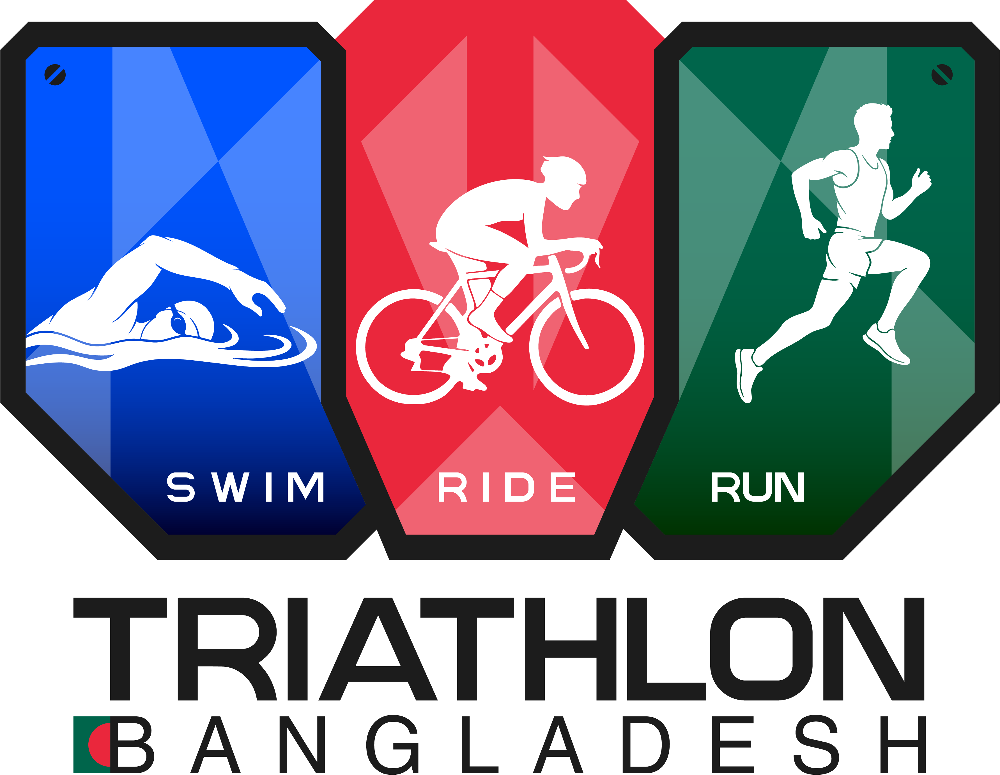
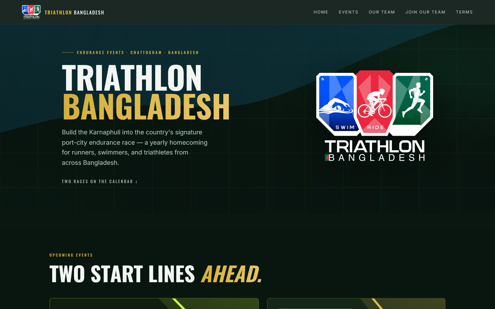
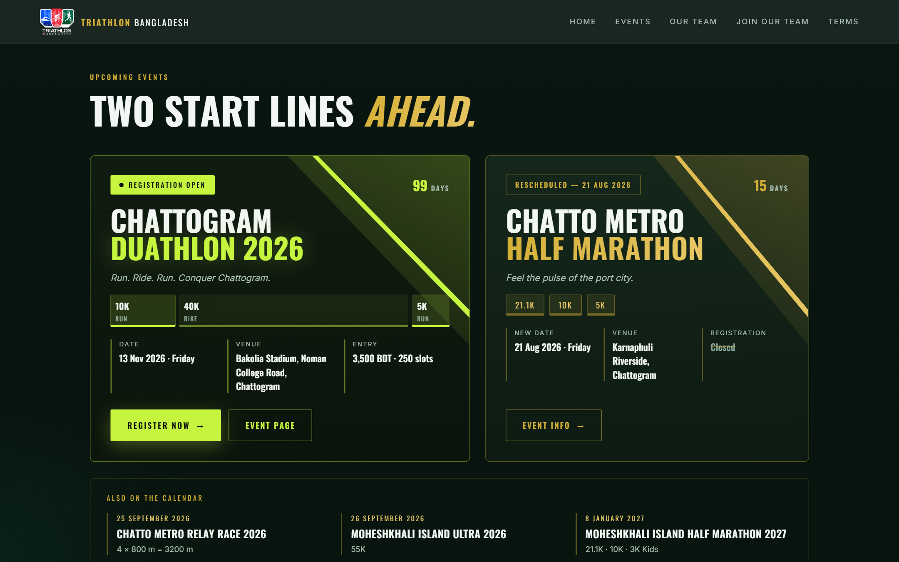
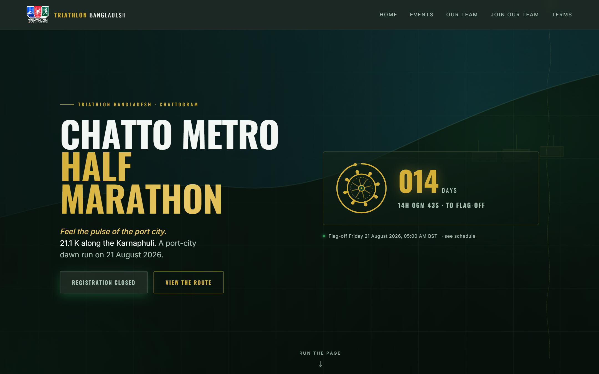
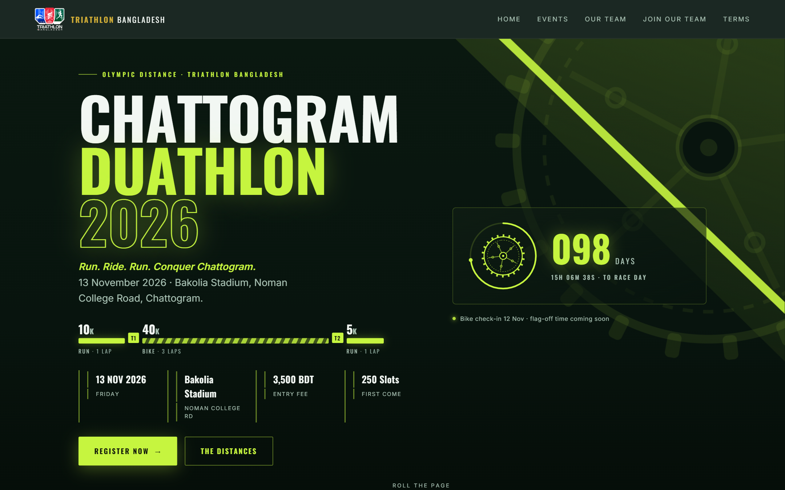
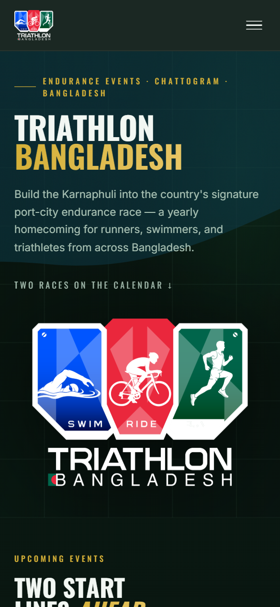

<div align="center">



# Triathlon Bangladesh

**Swim · Bike · Run**

A dark-premium endurance sports website for Bangladesh's port-city race calendar — event hubs, live countdowns, course guides, and race archives.

[](https://triathlonbangladesh.com)
[](https://astro.build)
[](https://react.dev)
[](https://www.typescriptlang.org)
[](https://tailwindcss.com)

</div>

---

## Overview

Triathlon Bangladesh organises endurance races along the Karnaphuli in Chattogram. This is the organisation's public website: a brand homepage, a detail page for every race on the calendar, and an archive of everything already run.

Two races are currently live on the site, each with its own visual identity rendered from the same codebase:

| Event | Date | Distances | Skin |
|---|---|---|---|
| **Chattogram Duathlon 2026** | 13 Nov 2026 | 10K run · 40K bike · 5K run | Chartreuse / chainring |
| **Chatto Metro Half Marathon 2026** | 21 Aug 2026 | 21.1K · 10K · 5K | Gold / ship's wheel |

Everything the visitor reads — dates, prize pools, entitlements, schedules, FAQ, team — comes from one typed data file (`src/data/event.ts`). Components never hardcode facts, so a content change is a one-line data edit, not a component rewrite.

---

## Screenshots

<div align="center">

### Homepage — brand hero



### Dual-event feature — two races, two identities, one grid



### Event detail — Chatto Metro Half Marathon



### Event detail — Chattogram Duathlon



### Mobile



</div>

---

## Features

**Multi-event engine.** One dynamic route (`/events/[slug]`) renders every race from typed data. Race, training-program, and community-participation events each get the layout that fits them.

**Per-event theme skins.** The Duathlon page swaps the entire palette and geometry — chartreuse tokens, a toothed chainring where the ship's wheel goes, a Run-Bike-Run proportional strip. Fully scoped under a `.dua-page` wrapper, so nothing leaks onto the rest of the site.

**SSR-safe live countdowns.** Countdown rings seed their clock from a server-rendered timestamp before hydrating, so the ring never flickers or snaps on first paint.

**Registration state as data.** A single `registrationOpen` flag flips every CTA on the site between "Register Now" and a closed state. No per-component conditionals.

**Full race hub per event.** Course maps, age-category grids, prize structures, entitlements, flag-off schedules, pacer cards, medal and jersey carousels, partner marquees, and FAQ accordions.

**Motion that asks permission.** Every animation — wheel spin, chainring rotation, marquee, count-up — has a static `prefers-reduced-motion` fallback.

**SEO and structured data.** Per-page canonical URLs, `SportsEvent` JSON-LD (overridable per event), Open Graph tags, and an auto-generated sitemap.

**Hardened headers.** CSP, HSTS with preload, `nosniff`, referrer policy, and a locked-down permissions policy, all set in `vercel.json`.

---

## Tech Stack

| Layer | Choice |
|---|---|
| Framework | **Astro 5** — static by default, islands on demand |
| Interactivity | **React 18** islands (`client:idle`, `client:visible`) |
| Language | **TypeScript** |
| Styling | **Tailwind CSS 3** + CSS custom-property design tokens |
| Fonts | **Fontsource** — self-hosted Oswald, Inter, Noto Sans Bengali |
| Hosting | **Vercel** (SSR adapter + Web Analytics) |

### Architecture notes

- **Island architecture.** Pages ship zero JavaScript by default. Only the eight interactive components hydrate, each with an explicit `client:` directive.
- **Design tokens over hardcoded values.** Colours and sizes live as CSS custom properties in `global.css`, which is what makes a whole-page theme swap a token override rather than a restyle.
- **Content as data.** Every user-facing string sits in `src/data/event.ts`, so a future Bangla toggle is a data swap, not a component rewrite.
- **Dual build mode.** Local builds are fully static; Vercel builds switch to the SSR adapter automatically via the `VERCEL` env var.

---

## Dependencies

**Runtime**

| Package | Purpose |
|---|---|
| `astro` | Framework and build pipeline |
| `react` · `react-dom` | Interactive islands |
| `@fontsource/oswald` | Display typeface (headings) |
| `@fontsource/inter` | Body typeface |
| `@fontsource/noto-sans-bengali` | Bangla text support |

**Development**

| Package | Purpose |
|---|---|
| `@astrojs/react` | React island integration |
| `@astrojs/tailwind` | Tailwind integration |
| `@astrojs/sitemap` | Sitemap generation at build time |
| `@astrojs/vercel` | Vercel SSR adapter |
| `tailwindcss` | Utility CSS |
| `@types/react` · `@types/react-dom` | React type definitions |
| `png-to-ico` | Favicon generation from the shield mark |

---

## Running Locally

**Prerequisites:** Node.js 18.17.1+ (or 20.3+ / 22+) and npm.

```bash
# 1. Clone
git clone https://github.com/NiruddeshJatra/triathlon-bangladesh.git
cd triathlon-bangladesh

# 2. Install
npm install

# 3. Start the dev server
npm run dev
```

Open **http://localhost:4321**. No environment variables or API keys are needed — the site is fully self-contained.

### Scripts

| Command | What it does |
|---|---|
| `npm run dev` | Dev server with HMR at `localhost:4321` |
| `npm run build` | Production build into `dist/` |
| `npm run preview` | Serve the built output locally |
| `npm run astro` | Astro CLI passthrough (`astro check`, `astro add`, …) |

---

## Project Structure

```
src/
├── components/         # Astro components (static)
│   └── duathlon/       # Chartreuse-skinned Duathlon page, scoped to .dua-page
├── islands/            # React components that hydrate (8 total)
├── data/event.ts       # Single source of truth for ALL content
├── layouts/            # HTML shell, meta tags, JSON-LD
├── pages/              # /, /events/[slug], /team, /join, /terms
└── styles/global.css   # Design tokens + component styles

public/assets/          # Logos, event galleries, team photos, merch shots
docs/                   # Working docs, decisions log, content reference
```

---

## Links

| | |
|---|---|
| **Live site** | https://triathlonbangladesh.com |
| **Facebook** | [Triathlon Bangladesh](https://www.facebook.com/profile.php?id=61570694557616) |
| **Email** | triathlonbangladesh.swimbikerun@gmail.com |
| **Repository** | https://github.com/NiruddeshJatra/triathlon-bangladesh |

### Reference docs

| File | Contents |
|---|---|
| [AGENTS.md](AGENTS.md) | Working contract and scope rules for contributors |
| [docs/CLAUDE.md](docs/CLAUDE.md) | Project orientation, commands, full file map |
| [docs/DECISIONS.md](docs/DECISIONS.md) | Locked architectural decisions |
| [docs/CONTENT.md](docs/CONTENT.md) | Canonical event facts |
| [docs/DESIGN_BRIEF.md](docs/DESIGN_BRIEF.md) | Visual direction and design system |

---

## Contributing

Read [AGENTS.md](AGENTS.md) before opening a PR. The short version:

- Content changes go in `src/data/event.ts` — never hardcode facts in components.
- Use CSS design tokens, not raw hex values or pixel literals.
- Every animation needs a `prefers-reduced-motion` fallback.
- Run `npm run build` and confirm zero errors before pushing.
- Change only what the task names. No adjacent refactors.

---

<div align="center">

Built for the athletes of Chattogram.

</div>
